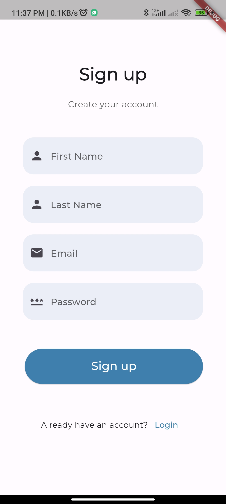
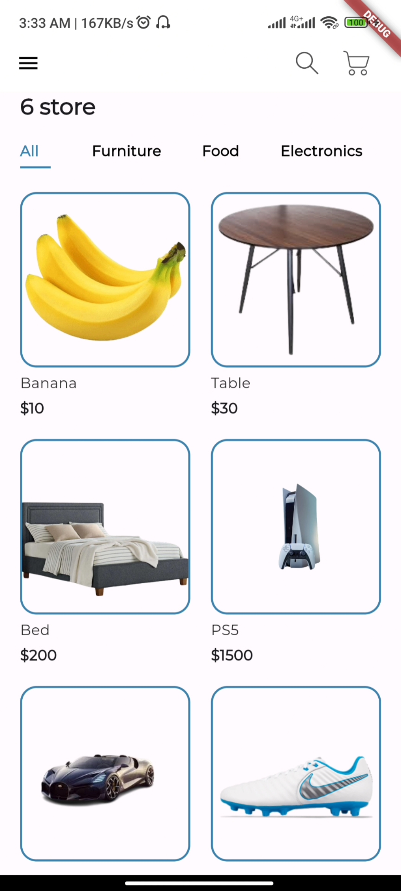
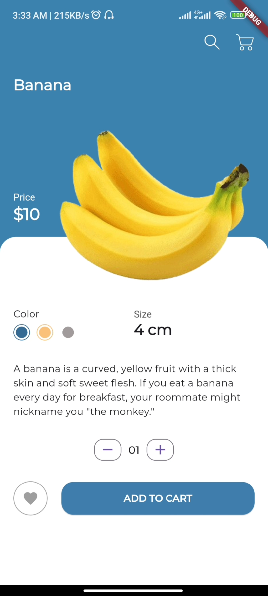
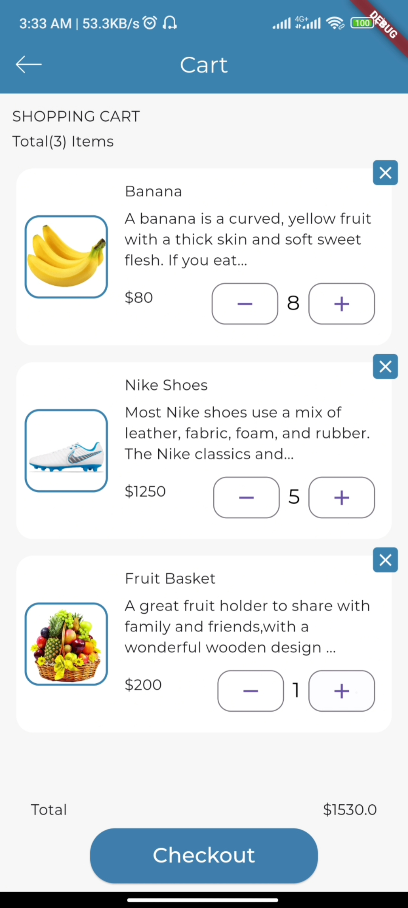
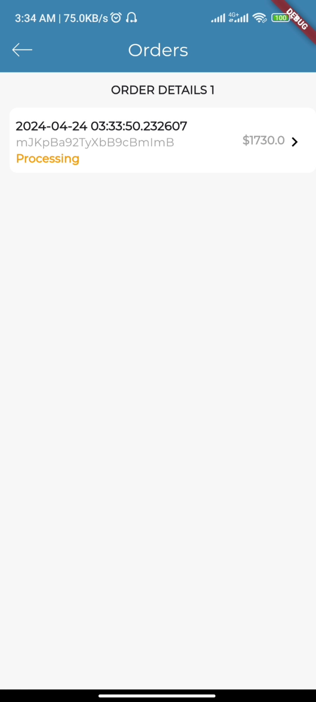
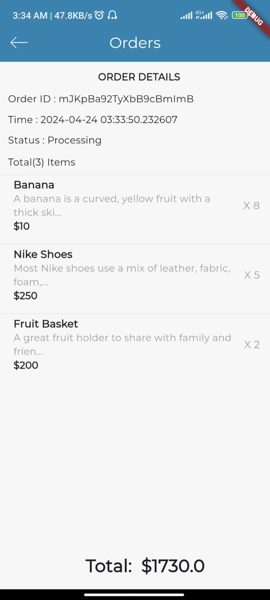
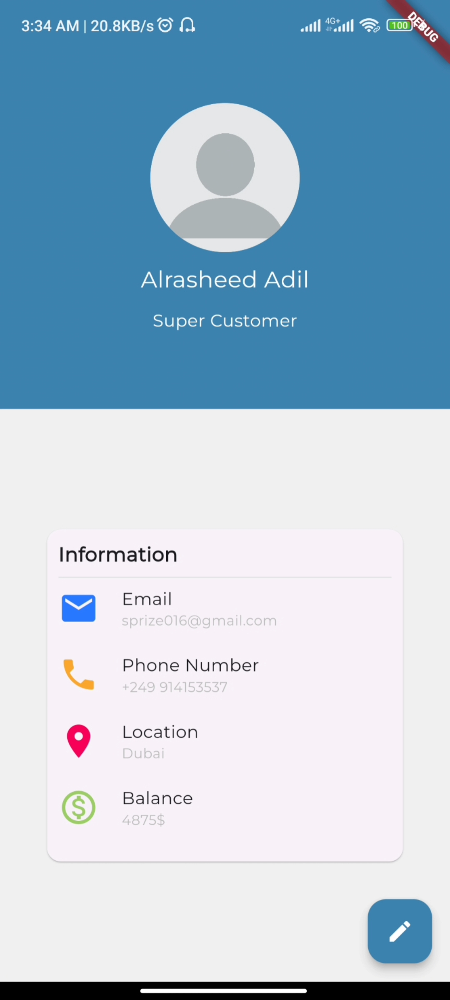

🛍️ 6 Store - An eCommerce Mobile App

Welcome to 6 Store, an eCommerce mobile app built to provide users with a convenient and seamless shopping experience right at their fingertips. Whether you're a shopper looking for the latest trends or a business owner seeking to expand your online presence, this app has something for you.

🚀 Key Features:

Browse a vast selection of products from various categories, including fashion, electronics, home goods, and more.
Search for specific products using keywords or filters to find exactly what you're looking for.
View detailed product descriptions, images, prices, and availability information.
Add products to your cart and proceed to a secure checkout process.
Explore personalized recommendations based on your browsing and purchase history.
Engage with customer reviews and ratings to make informed purchasing decisions.
Manage your account settings, including addresses, payment methods, and preferences.

🔧 Technologies Used:

Flutter for cross-platform mobile app development.
Firebase for backend services, including authentication, database, and cloud functions.

📱 Screenshots:

🌟 Star this repo if you find it helpful and contribute to its development!

